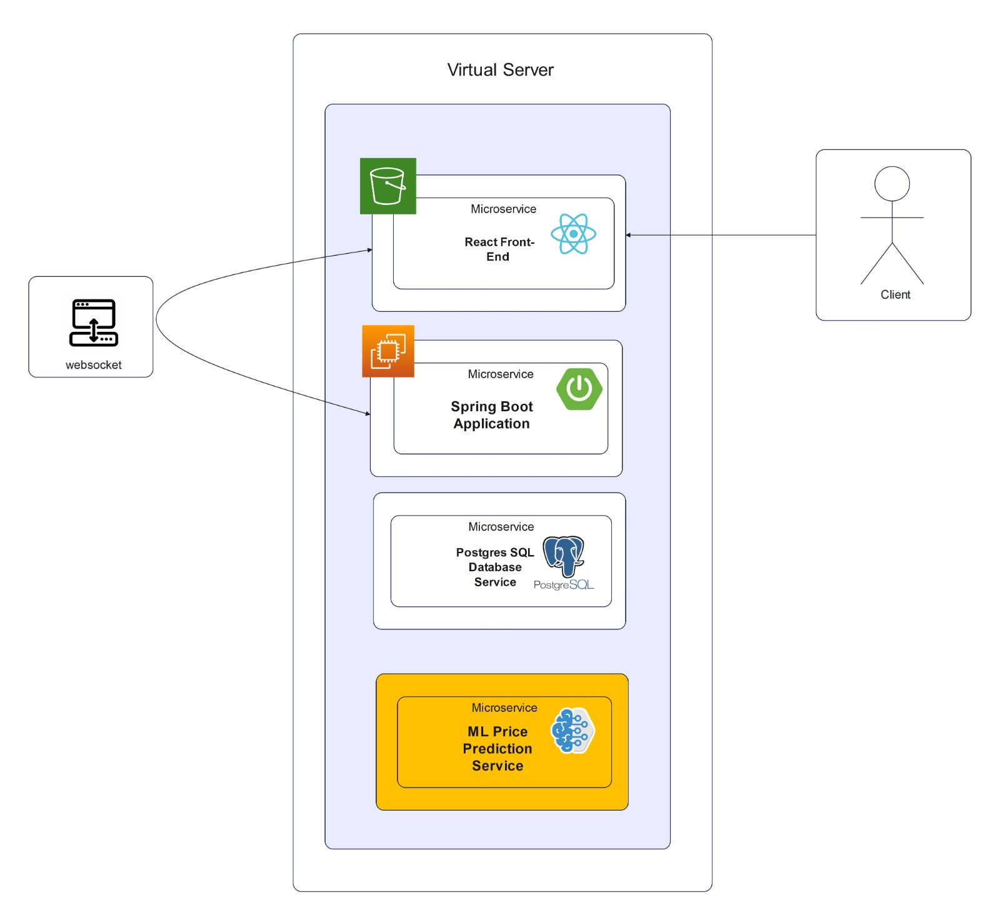
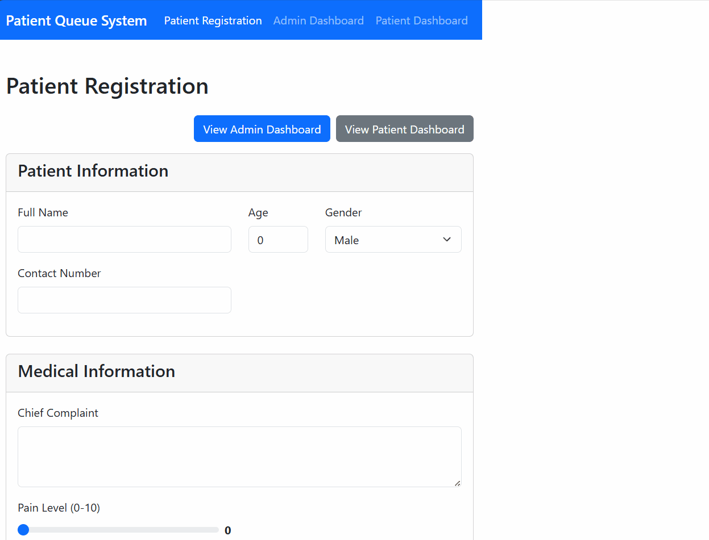
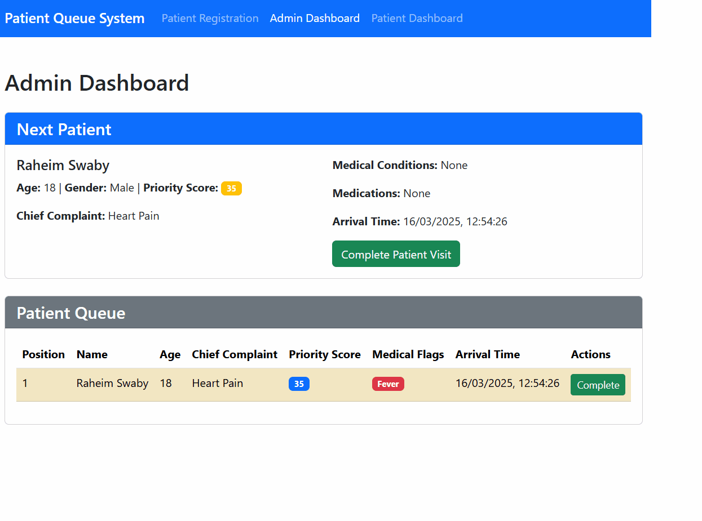
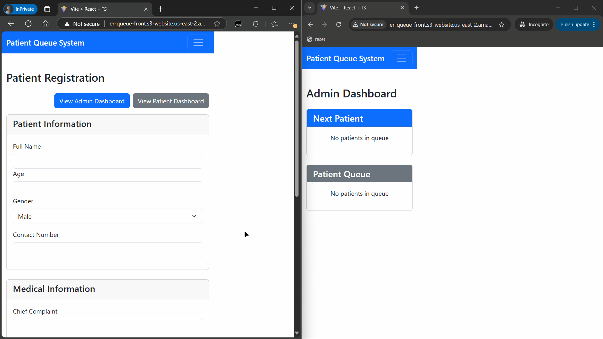

.. _quickhealthx:

=============
QuickHealthX
=============

A real-time patient queue management system for emergency rooms and healthcare facilities.

.. image:: https://img.shields.io/badge/Spring%20Boot-3.4.3-brightgreen.svg
   :target: https://spring.io/projects/spring-boot
   :alt: Spring Boot

.. image:: https://img.shields.io/badge/React-19.0.0-blue.svg
   :target: https://reactjs.org/
   :alt: React

.. image:: https://img.shields.io/badge/TypeScript-5.7.2-blue.svg
   :target: https://www.typescriptlang.org/
   :alt: TypeScript

.. image:: https://img.shields.io/badge/PostgreSQL-Latest-blue.svg
   :target: https://www.postgresql.org/
   :alt: PostgreSQL

Overview
=========

QuickHealthX is a bleeding edge emergency room queue software that uses prioritization to optimize wait times and care.

Key Features
============

- **Intelligent Queue Prioritization**: Automatically calculates patient priority based on symptoms, age, and medical conditions
- **Real-time Updates**: Uses WebSocket for instant queue updates across all connected devices
- **Dual View System**: Separate dashboards for healthcare providers and patients
- **Privacy-Focused**: Public view shows limited patient information
- **Responsive Design**: Works on desktop and mobile devices

System Architecture
==================

Prerequisites
============

- JDK 17 or higher
- Node.js 18 or higher
- npm or yarn
- PostgreSQL 13 or higher
- Maven 3.8+

Installation
===========

Database Setup
--------------

1. Install PostgreSQL if not already installed
2. Create a new database:

.. code-block:: bash

   $ psql -U postgres
   postgres=# CREATE DATABASE quickhealthx;
   postgres=# CREATE USER qhx_user WITH ENCRYPTED PASSWORD 'yourpassword';
   postgres=# GRANT ALL PRIVILEGES ON DATABASE quickhealthx TO qhx_user;
   postgres=# \q

Backend Setup
------------

1. Clone the repository:

.. code-block:: bash

   $ git clone https://github.com/SlugVortex/QuickHealthX.git
   $ cd QuickHealthX/QuickHealthX/backend

2. Configure database connection:

Create or update ``src/main/resources/application.properties``:

.. code-block:: properties

   spring.application.name=er_queue
   spring.datasource.url=jdbc:postgresql://localhost:5432/quickhealthx
   spring.datasource.username=qhx_user
   spring.datasource.password=yourpassword
   spring.jpa.hibernate.ddl-auto=update
   spring.jpa.properties.hibernate.dialect=org.hibernate.dialect.PostgreSQLDialect

3. Build and application:

.. code-block:: bash

   $ ./mvn clean build install

Frontend Setup
-------------

1. Navigate to the frontend directory:

.. code-block:: bash

   $ cd ../frontend/frontend

2. Install dependencies:

.. code-block:: bash

   $ npm install
   # or with yarn
   $ yarn install

3. Run the development server:

.. code-block:: bash

   $ npm run dev
   # or with yarn
   $ yarn dev

4. Open your browser and navigate to ``http://localhost:3000``

Build for Production
-------------------

Backend:

.. code-block:: bash

   $ cd QuickHealthX/backend
   $ ./mvnw clean package

Frontend:

.. code-block:: bash

   $ cd QuickHealthX/frontend/frontend
   $ npm run build
   # or with yarn
   $ yarn build

The frontend build artifacts will be in the ``dist`` directory, ready to be deployed.

Usage
=====

Patient Registration
------------------

The registration form allows recipients to enter patient personal and medical information for triage.

**Key Features:**

- Personal information collection
- Detailed medical symptom reporting
- Pain level assessment
- Critical condition flagging

Admin Dashboard
-------------

Healthcare providers use this dashboard to manage the patient queue and provide care efficiently.

**Key Features:**

- Real-time patient queue with priority scoring
- Detailed patient medical information
- One-click patient completion
- Medical condition highlighting

WebSocket Integration
-------------------

Real-time updates ensure all users see the most current information.

**Key Features:**

- Instant queue updates across all devices
- Separate channels for public and admin views
- Automatic reconnection on network issues

Backend Implementation Details
==============================

Java Models
-----------

- **Patient**: Core entity with medical details and priority calculation logic
- **PatientPublicView**: Privacy-focused projection of patient data for public display

REST Endpoints
-------------

- ``GET /api/queue``: Retrieve all patients in the queue
- ``GET /api/queue/next``: Get the next patient to be seen
- ``POST /api/queue``: Add a new patient to the queue
- ``PUT /api/queue/{id}``: Update an existing patient
- ``DELETE /api/queue/{id}``: Remove a patient from the queue

WebSocket Topics
---------------

- ``/topic/admin-queue``: Complete patient data for healthcare providers
- ``/topic/public-queue``: Limited patient data for public display

Frontend Components
==================

- **PatientForm**: Registration form for new patients
- **AdminDashboard**: Complete queue management for healthcare providers
- **PatientDashboard**: Public view of the queue status
- **Navbar**: Navigation component

Services
--------

- **QueueService**: REST API client for patient queue operations
- **WebSocketService**: Real-time communication with the backend

Development
==========

Adding New Features
-----------------

1. Create feature branches from ``main``
2. Implement changes
3. Write tests
4. Submit a pull request

Code Style
---------

- Backend: Follow Spring Boot best practices and Google Java Style Guide
- Frontend: Follow ESLint configuration

Testing
-------

Backend:

.. code-block:: bash

   $ cd QuickHealthX/backend
   $ ./mvnw test

Frontend:

.. code-block:: bash

   $ cd QuickHealthX/frontend/frontend
   $ npm run test
   # or with yarn
   $ yarn test

Troubleshooting
==============

Common Issues
-----------

1. **WebSocket Connection Errors**:
   - Verify CORS configuration in ``WebSocketConfig.java``
   - Check browser console for detailed error messages

2. **Database Connection Issues**:
   - Verify PostgreSQL is running
   - Check connection credentials in ``application.properties``

3. **UI Not Updating**:
   - Verify WebSocket connections in browser developer tools

Getting Help
-----------

If you encounter problems:

1. Check the troubleshooting section above
2. Open an issue on GitHub with:
   - Detailed description of the problem
   - Steps to reproduce
   - Relevant logs

Acknowledgements
===============

Technology Stack
--------------

- **Spring Boot**: Backend framework providing robust REST API and WebSocket functionality
- **React**: Frontend library for building the responsive user interface
- **Bootstrap**: CSS framework for responsive design and UI components
- **PostgreSQL**: Reliable database for data persistence
- **WebSocket/STOMP**: Real-time communication protocol
- **TypeScript**: Type-safe programming for the frontend
- **Maven**: Dependency management and build tool for the backend
- **Vite**: Modern frontend build tooling

Author
======
Team FIG
ClaudeAI - Documentation support
